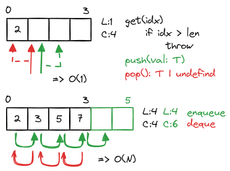
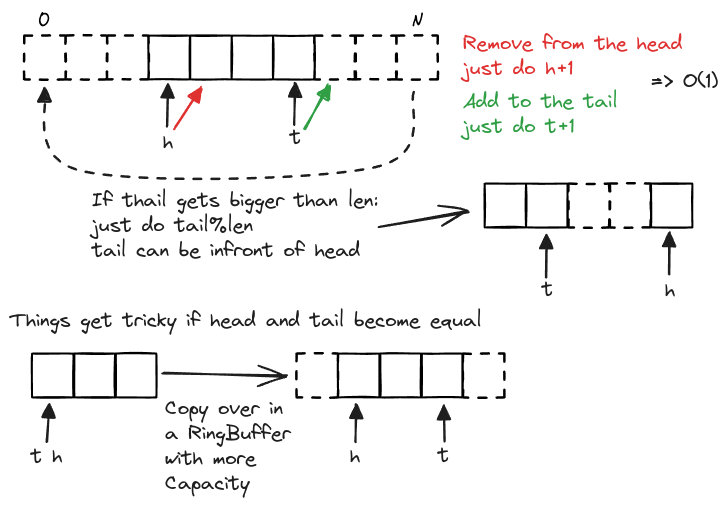

# Arrays

## Arrays vs Linked List

In an _Array_, you have direct access to indices. When an _Array_ is created, memory is simply allocated. However, _Arrays_ don't support direct insertion; to insert, you need to manually write loops to shift elements and then place the new value (or shift and overwrite for deletion). _Array_ operations have constant time complexity, O(1).  In contrast, when using a _Linked List_, memory isn't pre-allocated. A new node is created for each insertion. However, to retrieve an element from a _Linked List_, you must traverse it through a linear search.  If you need to scan or access elements randomly, _Arrays_ are more efficient. But if you only need to push or pop from either the head or tail, a _Linked List_ is a better choice.

## ArrayList

Can we have an array access with the ability to grow?

## RingBuffer

