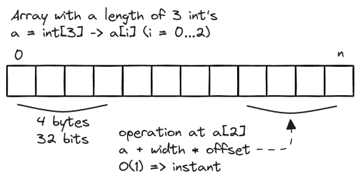

# Big O Time Complexity and Arrays

## Big O Time Complexity

### Why do we use it?

Often it will help us make decisions about what data structures and algorithms to use. Knowing how they will perform can greatly help create the best possible program out there.

As your input grows, how fast does computation or memory grow?

### Important Concepts

**Growth is with respect to the input**<br /> Obviously memory growing is not computationally free, but in the matter of thinking about algorithms, we don't necessarily thing about that.

**Constants are dropped**<br />_O(2N)_ -> _O(N)_ => Big O is meant to describe the upper bound of the algorithm (or the growth of the algorithm). The constant eventually becomes irrelevant.

**Only consider the worst case**<br />

### Basic Examples

**Example - _O(N)_**

```typescript
function sum_char_codes(n: string): number {
    let sum = 0;
    for (let i = 0; i < n.length; ++i) {
        sum += n.charCodeAt(i);
    }

    return sum;
}
```

**Example - _O(N²)_**

```typescript
function sum_char_codes(n: string): number {
    let sum = 0;
    for (let i = 0; i < n.length; ++i) {
        for (let j = 0; j < n.length; ++j) {
            sum += n.charCodeAt(i);
        }
    }

    return sum;
}
```

## Arrays Data Structures

If `const a = []` isn't an array (in JavaScript), what is it? We will see it later...



Example in NodeJS:

```javascript
const a = new ArrayBuffer(6);
const a8 = new Uint8Array(a);
const a16 = new Uint16Array(a);

a8[0] = 45;
a8[2] = 45;

// <2d 00 2d 00 00 00>

a16[2] = 0x4545;

// <2d 00 2d 00 45 45>
```

Arrays are fixed size, contiguous memory chunks, that means you cannot grow it and there is no "_insertAt_" or push or pop. (Doesn't mean you can't write those though.)
