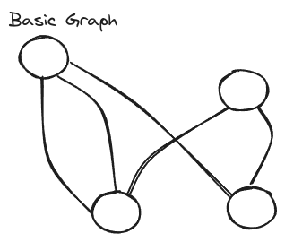

# Graphs

## Overview

### Terminology of Graphs

-   **Cycle** - When you start at Node(x), follow the links, and end back at Node(x).
-   **Acycle** - A Graph that contains no cycles.
-   **Connected** - When every Node has a path to another Node.
-   **Directed** - When there is a direction to the connections.
-   **Undirected** - The opposite of _Directed_.
-   **Weighted** - The edges have a weight associated with them.
-   **Dag**- Directed, Acycle Graph

### Implementation Terms

-   **Node** - A Point or Vertex on the Graph.
-   **Edge** - The Connection between two Nodes.

### Big O

Big O is commonly stated in terms of _V_ and _E_, where _V_ stands for the vertices and _E_ stands for the Edges. So _O(V\*E)_ means that we will check every vertex, and on every vertex we check every edge.
