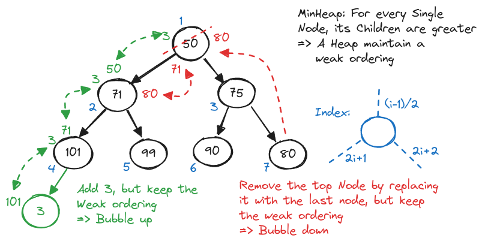

# Heap and Tries

## Heap

The simplest way to put it is a binary tree where every child and grand child are smaller (MaxHeap), or larger (MinHeap) than the current node.

-   Whenever a node is added, we must adjust the tree
-   Whenever a node is deleted, we must adjust the tree
-   There is no traversing the tree

