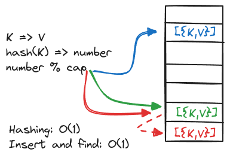

# Maps & LRU

## Maps

### Terminology

-   **Load Factor** - The amount of data points vs the amount of storage (_data.len / storage.capacity_).
-   **Key** - A value that is hashable and is used to look up data. The hash has to be consistent.
-   **Value** - A value that is associated with a key.
-   **Collision** - When 2 keys map to the same cell.
