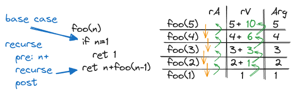

# Recursion

## What is Recursion?

The simplest way to think of recursion is a function that calls itself until the problem is solved. This usually involves what is referred to as a _"base case"_. A base case is the point which the problem is solved at.

**Simple Example**

```typescript
function foo(n: number): number {
    //base case
    if (n === 1) return 1;

    // we shall recurse
    return n + foo(n - 1);
}
```


