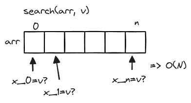
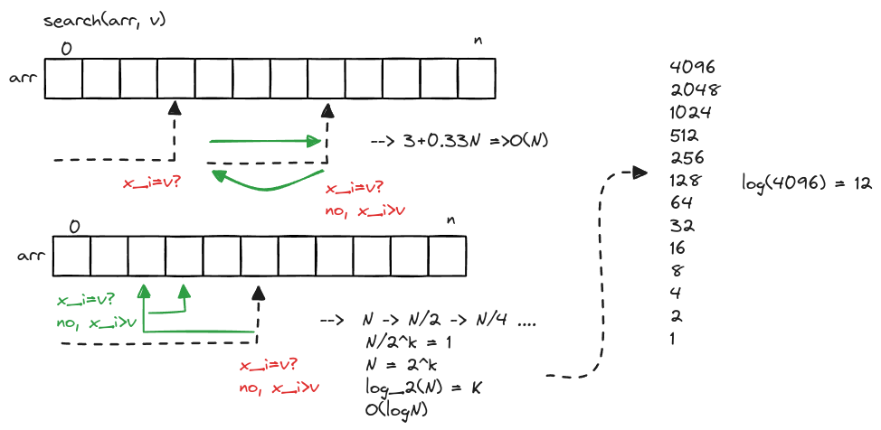
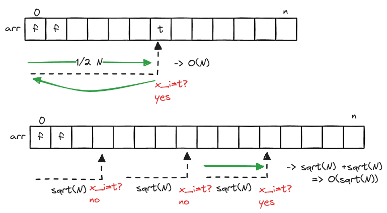

# Search - Linear & Binary

## Linear Search



## Binary Search

It is a bit doozy, but its definitely a basis for other algorithms!<br /> Important question about the dataset: is it ordered? If yes, you will have great advantages!



**Pseudo Code**

```javascript
search(arr, lo, hi, n);

do
    m = floor(lo + (hi - lo) / 2);
    v = arr[m]
    if v = n return true
    else if v > n
        hi = m
    else
        lo = m+1
while lo < hi
return false
```

## Two Crystal Ball Problem

> Given two crystal balls that will break if dropped from high enough distance,<br />determine the exact spot in which it will break in the most optimized way.


