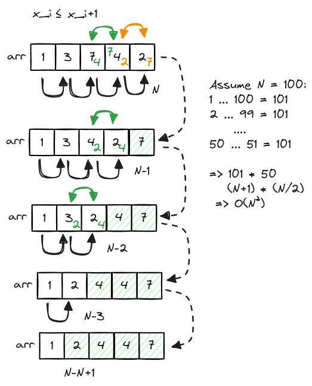
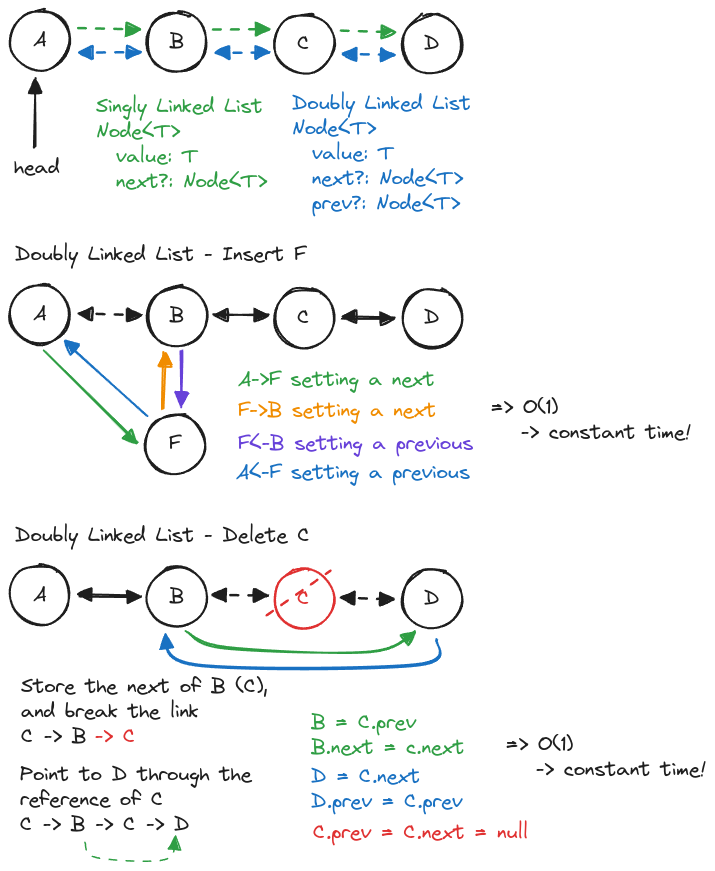
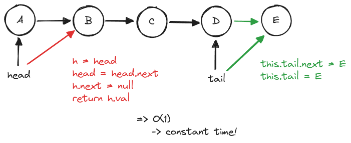
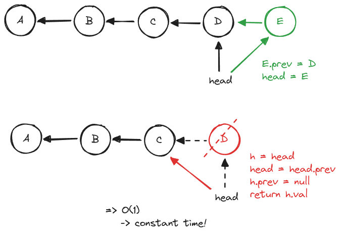

# Sort

## Bubble Sort



**Pseudo Code**

```javascript
for i..n
    for j..n-1-i
        if (arr[i] > arr[j])
            swap(i,j)
```

## Linked Lists



## Queue & Stack

**Queue**



**Stack**


