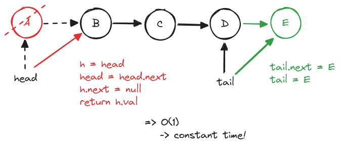

# Sort

## Bubble Sort


**Pseudo Code**

```javascript
for i..n
    for j..n-1-i
        if (arr[i] > arr[j])
            swap(i,j)
```

## Linked Lists


## Queue & Stack

**Queue**



**Stack**


## QuickSort

### What is Divide and Conquer?

Divide and conquer is a problem-solving strategy that involves breaking down a complex problem into smaller, more manageable subproblems. By dividing the input into smaller chunks or subsets, each of these subproblems can be solved independently, often with greater efficiency. Once the subproblems are solved, their solutions are combined to form the solution to the original problem.

### Basic Explanation

This QuickSort Alogrithm uses [recursion](../recursion/index.md)


### Running Time

QuickSort performs efficiently when the pivot element splits the array into two roughly equal halves at each recursive step. This ensures that the depth of the recursion tree is _log₂(n)_, and at each level, QuickSort performs a linear amount of work (_O(n)_) to partition the array. Therefore, the total running time is _O(n log n_), where n is the number of elements in the array.

In the worst case, QuickSort performs poorly if the pivot element is consistently the smallest or largest element, leading to highly unbalanced partitions. Instead of dividing the array in half, the array is split into one large and one small subarray (or none), making the recursion depth closer to n. In this scenario, the algorithm performs _O(n)_ work for each level of recursion, and since there are n levels, the total running time becomes _O(n²)_.
