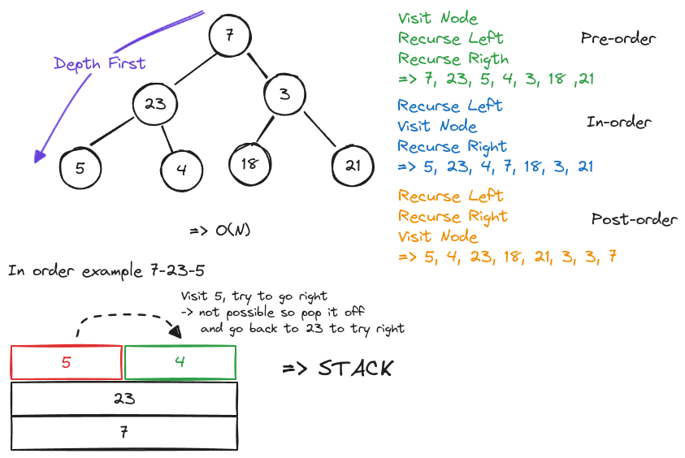

# Trees

## Overview

### Terminology

-   **Root** - The most parent Node.
-   **Height** - The longest path from the root to the most child Node.
-   **Binary Tree** - A Tree in which every Node has at most 2 children, at least 0 children.
-   **General Tree** - A Tree with 0 or more children
-   **Binary Search Tree** - A Tree which has a specific ordering to the Nodes and at most 2 children
-   **Leaves** - A Node without children
-   **Balanced** A Tree is perfectly _balanced_ when any Node's left and right children have the same height.
-   **Branching Factor** - The amount of children a Tree has.

## Tree Traversal

These types of traversals are known as **Depth First Search** (or DFS).

### Breadth-First Search

### Binary Tree Comparison

## Binary Search Tree (BST)

